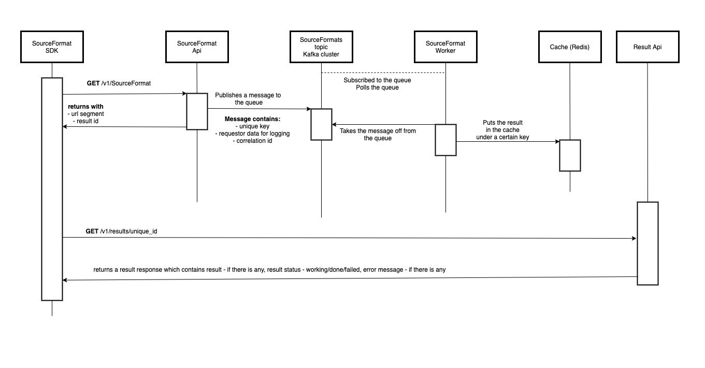

I have this [Encyclopedia Galactica](https://github.com/EncyclopediaGalactica) project and beside
designing and coding the whole project I'm going to deal with its infrastructure too. 

The architecture of the project is CQRS, meaning the client can indicate its needs (give me some
data please) by posting a request to the endpoints, but it won't get a result answer, rather it gets
and URL which should be polled and when status field indicates that the operation is executed and
its result is available the client will get it. This idea comes from
[Azure's Durable Functions](https://docs.microsoft.com/en-us/azure/azure-functions/durable/durable-functions-overview?tabs=csharp)
.

The other detail is that it will be based on microservices. I'm going to split the whole system to
independent services as much as possible. The system will be event-driven where the messaging will
be responsibility of a Kafka cluster. The architecture will be over-engineered purposefully. I need
to make mistakes and learn from them.

CQRS and microservices indicate that I need an infrastructure where **1,** I can easily create new
services, **2,** modify them and **3,** deploy them independently. I would also add that it has to
be cloud provider-agnostic, meaning I can deploy the system in AWS, Azure, GC, IBM's Kubernetes or
my own Kubernetes cluster with minimal configuration changes.

In this MVP phase I'm going to implement the SourceFormat functionality. There will be another
article about this functionality later. This functionality from architecture point of view consists
of the following elements:

- **UI Service** - this one is optional, if WebAssembly then it is needed because from here the
  browser can download the UI. If not WebAssembly then the SourceFormat Api can do this job, or I
  need to spend a little time to figure out whether worth to separate or not.
- **SourceFormat SDK** - it is a provided SDK for the UI, so it can programmatically communicate
  with the backend.
- **SourceFormat Api** - this Api for managing SourceFormats in the system. A Rest service with JSON
  communication format. gRPC might be an option later.
- **SourceFormat topic** in a Kafka cluster
- **SourceFormat Worker** - this one does the real job. It communicates with the database and
  executes commands arriving from the Api.
- **Results Api** - A small Api over the Redis cache which from can read out values of given keys.

From technologies point of view I'm going to use the followings:

- **Blazor**, if WebAssembly development experience is greatly enhanced in .NET 6 then WebAssembly,
  if not then ServerSide (if the name of it hasn't changed since .NET 5)
- **.NET WebApi** for apis
- **.NET Service/BackgroundService** for workers (I need to check what other C# - based open source
  alternatives are available)
- **Kafka** for messaging
- **Redis** for caching
- **PostgreSQL** RDBMS
- **Kubernetes**
- **Docker**

The following UML(ish) diagram describes the functionality.

As a result I need to create the following Docker images, build CI/CD pipeline for them whenever it
is needed. Creation also includes figuring out the network and load balancing parts too. I really
don't have an idea how I'd like to do it, but I'll provide details when I write about the
implementation.

| Module Name                        | Docker Image | CI/CD | Nuget package |
|------------------------------------|:-------------|:------|:--------------|
| UI Service                         | yes          | yes   | no            |
| SourceFormat SDK                   | no           | yes   | yes           |
| SourceFormat Api                   | yes          | yes   | no            |
| SourceFormat Topic / Kafka cluster | yes          | yes   | no            |
| SourceFormat Worker                | yes          | yes   | no            |
| Results Api                        | yes          | yes   | no            |
| PostgreSQL RDBMS                   | yes          | yes   | no            |
| Redis                              | yes          | yes   | no            |

The study materials

- [Docker and Kubernetes: The Complete Guide by Stephen Grider](https://www.udemy.com/course/docker-and-kubernetes-the-complete-guide/)
- Docker manual
- Kubernetes manual
- other stuff which I'm going to list here